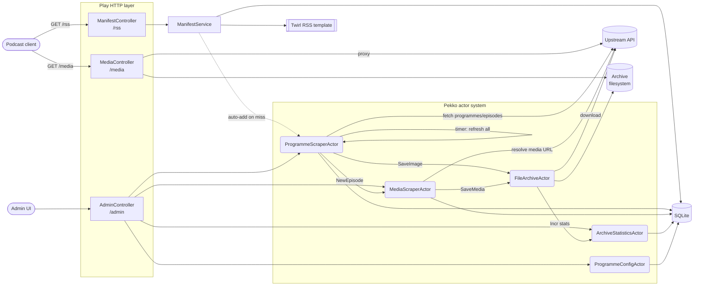

# Ohdieux

Converts RSS feeds for podcast clients.

Built with Scala 3, Play Framework, and Pekko typed actors. Optional media archival to local disk.

## Stack

- Scala 3 / Play Framework
- Pekko (typed actors) — scraping, downloads, stats
- Anorm + SQLite (JDBC) for persistence
- Twirl for RSS/XML rendering

## Architecture

Flow: `ProgrammeScraperActor` polls the upstream API on a timer and hands each discovered episode to `MediaScraperActor`, which resolves the audio URL and (optionally) asks `FileArchiveActor` to download it. `ManifestController` reads the resulting data from SQLite and renders it as an RSS feed through a Twirl XML template. Media is always served through `MediaController` — archived files are served directly, otherwise the upstream URL is proxied to ensure podcast clients receive audio content (not upstream `.mp4` video containers).

